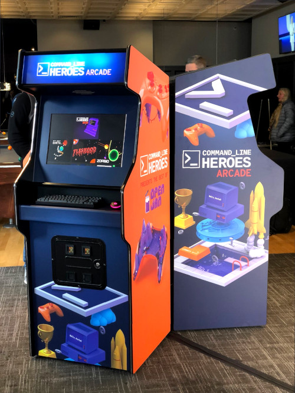

## Summary

Command Line Bash is a game that challenges you to type in as many valid commands as you can in 60 seconds.

<a class="pbp-btn" href="https://www.redhat.com/en/command-line-heroes/bash/index.html">Play now!</a>

Bash was created with co-conspirator [Jared Sprague][jsprague], along with tremendous help from the [Command Line Heroes podcast][clh] team, open source contributors, and the [CLH Discord][discord] community.

If you're into code, you're welcome to [view source][source].  Contributions welcome!

---

## How to play

The game walks you through the instructions when you play, but here are the basics.  The game challenges you to type in as many commands as you can in 60 seconds.  Commands can be drawn from a variety of languages.

 - bash shell commands & linux built-ins
 - JavaScript keywords, objects, functions
 - Python keywords, objects, functions
 - HTML5 tags

When play starts, you don't have to choose a language.  All languages are valid.

---

## Why we made it

About a year ago, Dan contacted us after seeing some of [our games][scripta].  After chatting for a while, the idea came up of creating a game based on Command Line Heroes (isn't the name just begging to be a game?).  A few months later, we were neck-deep in code for an adventure game engine called [Hero Engine][hero-eng].

Adventure games, we discovered, are very time-consuming to create, *especially* when you start by building an engine from scratch.  To scale back, we decided to build a new game in more of a game-jam style, one with a much smaller scope.  Our goal was to complete it in time for [IBM Think][think], the first conference where the game would be presented.

The strategy succeeded, and we were able to put the finishing touches on the game just before Think began.  Here's a bit about Bash @ Think.

---

## Cabs and confs

Not one to settle for the ordinary, Dan went the extra mile and ordered some classic arcade cabinets.  Fortunately, through my geekSPARK work I met Bill Culverhouse.  Bill is a maker extraordinaire, geekSPARK veteran, and happens to run an arcade cabinet construction company, [Triangle Home Gamerooms][trihg].

We met with them, toured their impressive facility, determined specs, and placed the order.

Here's what they built for us.

Notice the shout-out to [Open Jam][oj] on the orange side of the cabinets!  If you look closely at the screen, you can spot a few games in the launcher.

 - [CLH Bash][game]
 - [Pity About Earth...][pae]
 - [Fleshgod][fleshgod]
 - [Zorbio][zorb]

Several more games are below the fold.

As I'm writing this, Think has just concluded and was a huge success for the Command Line Heroes team.

---

## What's next?

Next up, I'm working on a post about the tech we used to create the game.

Until then, here are some ways to get involved.

## Join the community

Discord link.

[game]: https://www.redhat.com/en/command-line-heroes/bash/index.html
[source]: https://github.com/CommandLineHeroes/clh-bash
[scripta]: http://scripta.co
[hero-eng]: https://github.com/CommandLineHeroes/hero-engine
[clh]: https://www.redhat.com/en/command-line-heroes
[jsprague]: https://twitter.com/caramelcode
[discord]: https://discord.gg/DYEGmFc
[phaser]: https://www.phaser.io/phaser://www.phaser.io/phaser3
[tiled]: https://www.mapeditor.org/
[spec]: https://github.com/CommandLineHeroes/hero-engine/blob/master/doc/spec.md
[think]: https://www.ibm.com/events/think/
[trihg]: https://www.trihg.com/
[oj]: http://openjam.io
[fleshgod]: https://itch.io/jam/open-jam-2018/rate/314668
[pae]: http://pae.fun
[zorb]: https://zorb.io
