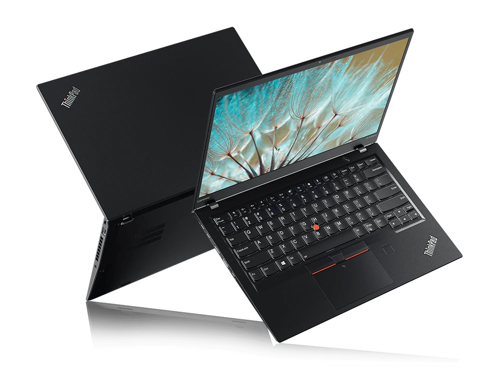

It's a tale as old as time.  A nice laptop.  A nearby cold beverage.  A sickening splash.  Thanks to the solid seals on the [Carbon](https://en.wikipedia.org/wiki/ThinkPad_X1_Carbon#2018_%E2%80%93_6th_generation), there was no permanent damage, just a very sticky, nearly unusable keyboard.  Rather than clean or replace the keyboard, our support desk opted to issue a new laptop.

That's how I found myself with two identical laptops, one whose SSD had a fully configured OS, and the other with an empty SSD in need of such an OS.



To get the old laptop's data onto the new laptop as quickly as possible, I wanted to do a quick and dirty clone without having to learn how to use a new tool, without having to find a large disk to store an intermediary copy of the disk image, and without taking hours and hours to transfer.  With the help of a few StackOverflow posts, I settled on the following solution which makes use of two [Fedora](https://getfedora.org/) live USB drives, `dd` and `netcat`.

---

## Step 0. Preliminary notes

The first thing to note is that this method is not secure (it's unencrypted) and is meant to be used on a private local network only.

These steps are unlikely to work if the hardware is not identical.  If the destination disk is even a little bit smaller, things are likely to fail catastrophically.  And if it's larger, you won't have access to that extra space unless you resize your partitions after the image is transferred.

I bear no responsibility for the outcome of these instructions.

I make mistakes.  Please read and understand the steps before running any of them.

I wrote this mostly as a note-to-self, but if it helps someone out, great!

One other thing before moving on. A wired network is *far superior* to wireless for what's coming next.

---

## Step 1. Live OS on both laptops

First, I grabbed two USB thumb drives, [put a Fedora live system](https://docs.fedoraproject.org/en-US/fedora/f30/install-guide/install/Preparing_for_Installation/#sect-preparing-boot-media) on them, and booted up both laptops from the thumb drives.

Once Fedora live is booted up, open a terminal on each laptop and run:

```
sudo -i
```

We'll use these rooted terminals for all following steps.

Now that Fedora live is running on both laptops, we'll set up the destination laptop first.

---

## Step 2. Prepare the destination laptop to receive the image

On the destination laptop, you'll need two pieces of information to proceed.

### The destination laptop's *wired* IP address

To find *wired* IP address, use either use `ip addr` or Settings / Network.  Once you find it, go to the *old laptop* and run `export NEW_LAPTOP_IP="1.2.3.4"` but replace `1.2.3.4` with the IP you found.  Then go back to the destination laptop.

### The path to the disk we're going to write the image onto

To find the path to the disk, run:

```
parted -l
```

You'll see something like this:

```
Model: SAMSUNG MZVLB256HAHQ-000L7 (nvme)
Disk /dev/nvme0n1: 256GB
Sector size (logical/physical): 512B/512B
Partition Table: msdos
Disk Flags:

Number  Start   End     Size    Type     File system  Flags
 1      1049kB  1075MB  1074MB  primary  ext4         boot
 2      1075MB  256GB   255GB   primary
```

The bit we're looking for is on the second line, `/dev/nvme0n1`.  If multiple disks appear, make sure to choose the right one.

Put it into an environment variable.

```
export DESTINATION_DISK="/dev/nvme0n1"
```

The last step for the destination laptop is to open the door and wait for the image to be sent.

```
nc -l 1234 | dd bs=16M of=$DESTINATION_DISK status=progress
```

This starts a netcat server listening on port 1234.  It then pipes any data sent to the netcat server directly onto the disk.  Now we just need to send the data.

---

## Step 3. Send the image from the old laptop

On the old laptop, we only need one piece of information: the path to the disk.  Use the same `parted -l` command from above to find it.  On my system, it was `/dev/nvme0n1`.  As before, save this in a variable.

```
export SOURCE_DISK=/dev/nvme0n1
```

The final step.  This command will send every bit from the old laptop's disk across the network to the new laptop, where the waiting netcat server will write it to the new laptop's disk.

This would be a good point to stop and make sure you understand every step thus far and (above all) make sure you're writing this data to the correct disk.  When you're ready:

```
dd bs=16M if=$SOURCE_DISK | nc $NEW_LAPTOP_IP 1234
```

The destination laptop will begin displaying statistics about the data as it streams in.

---

## Step 4. Rejoice

On my 256 gig disk, this ran at about 88 MiB/s, roughly 75% of the theoretical max for a 1 Gbps network.  It took took only 48 minutes to complete.


Having nearly saturated the network, I'm quite sure this was the fastest way I could have cloned the disk using generalized tools.  I'm sure there are faster ways with specialized hardware or software, but who has time for that?

Happy cloning.
